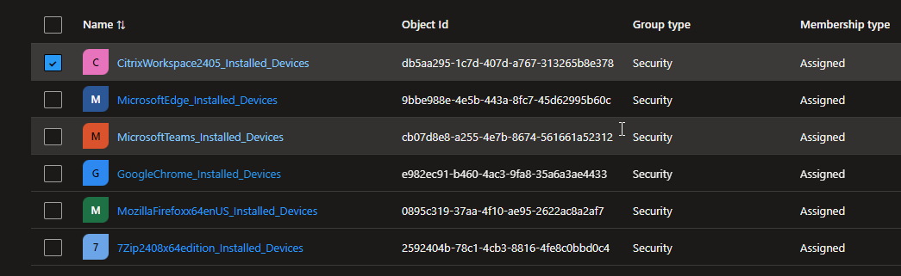

# Script Info

This script will check intune for discovered applications and then add the devices to a device group.  



> [!IMPORTANT]
> I wouldn't run this in production just yet. I still need to do more testing. 

# Sample Output

```Fetching all devices...
Total devices fetched: 48
Fetching all detected apps...
Total detected apps fetched: 823
Processing application: Google Chrome
Best match found: Google Chrome (Similarity: 100.00%)
Total devices with app installed: 9
Total unique devices with app installed: 9
Current group members: 9
Ivy24-3 is already a member of group 'GoogleChrome_Installed_Devices'.
PC0003 is already a member of group 'GoogleChrome_Installed_Devices'.
BFSSCDD24525537 is already a member of group 'GoogleChrome_Installed_Devices'.
PC0004 is already a member of group 'GoogleChrome_Installed_Devices'.
PC0001 is already a member of group 'GoogleChrome_Installed_Devices'.
Ivy24-1 is already a member of group 'GoogleChrome_Installed_Devices'.
ZURSBLD49440058 is already a member of group 'GoogleChrome_Installed_Devices'.
PC0002 is already a member of group 'GoogleChrome_Installed_Devices'.
LNKSCD794493855 is already a member of group 'GoogleChrome_Installed_Devices'.
Final group membership for GoogleChrome_Installed_Devices :
  -  (ID: e185651f-9d5c-4fa5-ae14-2c2c16d35872)
  -  (ID: 8cb64506-347c-4d3a-8a5c-9dc48d36c228)
  -  (ID: 122d4269-a124-415a-92c4-392dd9615a79)
  -  (ID: cfc4e008-3053-4acf-a93e-b588b407d5f6)
  -  (ID: 77e507c8-cf8c-4f97-8d1c-d4a2e8dc70ce)
  -  (ID: 17bf5ae4-0609-4b95-a97c-4be1963883b4)
  -  (ID: 98c82174-9503-4d7f-9b02-fe1f81158b29)
  -  (ID: 05544e4f-5b8d-4d4f-a09f-9159bb1987a6)
  -  (ID: c0e2fe6c-0008-42d8-97d6-e9b0e5fab692)
Processing application: Microsoft Edge
Best match found: Microsoft Edge (Similarity: 100.00%)
Total devices with app installed: 9
Total unique devices with app installed: 9
Current group members: 9
Ivy24-3 is already a member of group 'MicrosoftEdge_Installed_Devices'.
PC0003 is already a member of group 'MicrosoftEdge_Installed_Devices'.
BFSSCDD24525537 is already a member of group 'MicrosoftEdge_Installed_Devices'.
PC0004 is already a member of group 'MicrosoftEdge_Installed_Devices'.
PC0001 is already a member of group 'MicrosoftEdge_Installed_Devices'.
Ivy24-1 is already a member of group 'MicrosoftEdge_Installed_Devices'.
PC0002 is already a member of group 'MicrosoftEdge_Installed_Devices'.
LNKSCD794493855 is already a member of group 'MicrosoftEdge_Installed_Devices'.
JP’s MacBook Air is already a member of group 'MicrosoftEdge_Installed_Devices'.
Final group membership for MicrosoftEdge_Installed_Devices :
  -  (ID: e185651f-9d5c-4fa5-ae14-2c2c16d35872)
  -  (ID: 8cb64506-347c-4d3a-8a5c-9dc48d36c228)
  -  (ID: 122d4269-a124-415a-92c4-392dd9615a79)
  -  (ID: cfc4e008-3053-4acf-a93e-b588b407d5f6)
  -  (ID: 77e507c8-cf8c-4f97-8d1c-d4a2e8dc70ce)
  -  (ID: 17bf5ae4-0609-4b95-a97c-4be1963883b4)
  -  (ID: 07a28f7d-9f28-4edc-a373-1fa7fce8a628)
  -  (ID: 98c82174-9503-4d7f-9b02-fe1f81158b29)
  -  (ID: 05544e4f-5b8d-4d4f-a09f-9159bb1987a6)
Processing application: Mozilla Firefox (x64 en-US)
Best match found: Mozilla Firefox (x64 en-US) (Similarity: 100.00%)
Total devices with app installed: 4
Total unique devices with app installed: 4
Current group members: 4
PC0003 is already a member of group 'MozillaFirefoxx64enUS_Installed_Devices'.
PC0004 is already a member of group 'MozillaFirefoxx64enUS_Installed_Devices'.
PC0001 is already a member of group 'MozillaFirefoxx64enUS_Installed_Devices'.
PC0002 is already a member of group 'MozillaFirefoxx64enUS_Installed_Devices'.
Final group membership for MozillaFirefoxx64enUS_Installed_Devices :
  -  (ID: 122d4269-a124-415a-92c4-392dd9615a79)
  -  (ID: cfc4e008-3053-4acf-a93e-b588b407d5f6)
  -  (ID: 77e507c8-cf8c-4f97-8d1c-d4a2e8dc70ce)
  -  (ID: 17bf5ae4-0609-4b95-a97c-4be1963883b4)
Processing application: Citrix Workspace 2405
Best match found: Citrix Workspace 2405 (Similarity: 100.00%)
Total devices with app installed: 9
Total unique devices with app installed: 9
Current group members: 9
Ivy24-3 is already a member of group 'CitrixWorkspace2405_Installed_Devices'.
PC0003 is already a member of group 'CitrixWorkspace2405_Installed_Devices'.
BFSSCDD24525537 is already a member of group 'CitrixWorkspace2405_Installed_Devices'.
PC0004 is already a member of group 'CitrixWorkspace2405_Installed_Devices'.
PC0001 is already a member of group 'CitrixWorkspace2405_Installed_Devices'.
Ivy24-1 is already a member of group 'CitrixWorkspace2405_Installed_Devices'.
ZURSBLD49440058 is already a member of group 'CitrixWorkspace2405_Installed_Devices'.
PC0002 is already a member of group 'CitrixWorkspace2405_Installed_Devices'.
LNKSCD794493855 is already a member of group 'CitrixWorkspace2405_Installed_Devices'.
Final group membership for CitrixWorkspace2405_Installed_Devices :
  -  (ID: e185651f-9d5c-4fa5-ae14-2c2c16d35872)
  -  (ID: 8cb64506-347c-4d3a-8a5c-9dc48d36c228)
  -  (ID: 122d4269-a124-415a-92c4-392dd9615a79)
  -  (ID: cfc4e008-3053-4acf-a93e-b588b407d5f6)
  -  (ID: 77e507c8-cf8c-4f97-8d1c-d4a2e8dc70ce)
  -  (ID: 17bf5ae4-0609-4b95-a97c-4be1963883b4)
  -  (ID: 98c82174-9503-4d7f-9b02-fe1f81158b29)
  -  (ID: 05544e4f-5b8d-4d4f-a09f-9159bb1987a6)
  -  (ID: c0e2fe6c-0008-42d8-97d6-e9b0e5fab692)
Processing application: WinZip 28.0
Best match found: WinZip 28.0 (Similarity: 100.00%)
Total devices with app installed: 9
Total unique devices with app installed: 9
Current group members: 9
Ivy24-3 is already a member of group 'WinZip280_Installed_Devices'.
PC0003 is already a member of group 'WinZip280_Installed_Devices'.
BFSSCDD24525537 is already a member of group 'WinZip280_Installed_Devices'.
PC0004 is already a member of group 'WinZip280_Installed_Devices'.
PC0001 is already a member of group 'WinZip280_Installed_Devices'.
Ivy24-1 is already a member of group 'WinZip280_Installed_Devices'.
ZURSBLD49440058 is already a member of group 'WinZip280_Installed_Devices'.
PC0002 is already a member of group 'WinZip280_Installed_Devices'.
LNKSCD794493855 is already a member of group 'WinZip280_Installed_Devices'.
Final group membership for WinZip280_Installed_Devices :
  -  (ID: e185651f-9d5c-4fa5-ae14-2c2c16d35872)
  -  (ID: 8cb64506-347c-4d3a-8a5c-9dc48d36c228)
  -  (ID: 122d4269-a124-415a-92c4-392dd9615a79)
  -  (ID: cfc4e008-3053-4acf-a93e-b588b407d5f6)
  -  (ID: 77e507c8-cf8c-4f97-8d1c-d4a2e8dc70ce)
  -  (ID: 17bf5ae4-0609-4b95-a97c-4be1963883b4)
  -  (ID: 98c82174-9503-4d7f-9b02-fe1f81158b29)
  -  (ID: 05544e4f-5b8d-4d4f-a09f-9159bb1987a6)
  -  (ID: c0e2fe6c-0008-42d8-97d6-e9b0e5fab692)

Summary Report:
---------------
Application: Mozilla Firefox (x64 en-US)
  Original Search Term: Mozilla Firefox (x64 en-US)
  Total Devices with app installed: 4
  Devices added to group: 0
  Devices removed from group: 0
  Final group member count: 4

Application: WinZip 28.0
  Original Search Term: WinZip 28.0
  Total Devices with app installed: 9
  Devices added to group: 0
  Devices removed from group: 0
  Final group member count: 9

Application: Citrix Workspace 2405
  Original Search Term: Citrix Workspace 2405
  Total Devices with app installed: 9
  Devices added to group: 0
  Devices removed from group: 0
  Final group member count: 9

Application: Microsoft Edge
  Original Search Term: Microsoft Edge
  Total Devices with app installed: 9
  Devices added to group: 0
  Devices removed from group: 0
  Final group member count: 9

Application: Google Chrome
  Original Search Term: Google Chrome
  Total Devices with app installed: 9
  Devices added to group: 0
  Devices removed from group: 0
  Final group member count: 9```