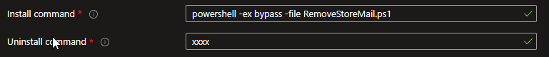
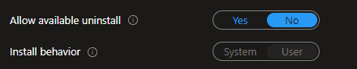
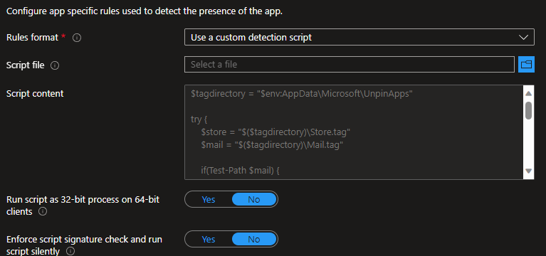
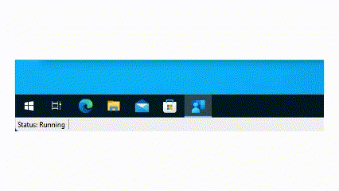

# Usage

Package theRemoveStoreMail.ps1 into a win32 app.

Use the “Detect-RemoveStoreMail.ps1”as the detection script.

### Program

**Install command**: powershell -ex bypass -file RemoveStoreMail.ps1

**Uninstall command**: none / empty 

Make sure the "Install Behavior" is set to User. 

### Detection

Use the “Detect-RemoveStoreMail.ps1”as the detection script.

### Video
